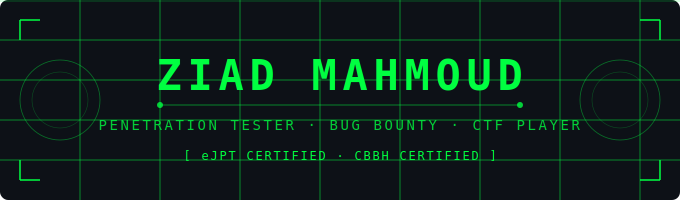

<p align="center">
  
</p>

<p align="center">
  
</p>

---

## 🧠 About Me

```python
class ZiadMahmoud:
    role       = "Cybersecurity Professional"
    focus      = ["Penetration Testing", "Bug Bounty", "CTF Challenges"]
    learning   = ["Web Application Security", "Network Pentesting", "Red Teaming"]
    motto      = "Think like an attacker, act like a defender."
```

---

## 🛠️ Tools & Technologies

<p align="center">
  
  
  
  
  
  
  
  
</p>

---

## 🎯 Areas of Focus

| Domain | Skills |
|--------|--------|
| 🔴 **Penetration Testing** | Network, Web App |
| 🐛 **Bug Bounty** | Recon, OWASP Top 10, Reporting |
| 🚩 **CTF** | HackTheBox, TryHackMe, PicoCTF |
| 🌐 **Network Security** | Nmap, Wireshark, Pivoting, MITM |

---

## 📜 Certifications

- ✅ **eJPT** — Certified *(eLearnSecurity Junior Penetration Tester)*
- ✅ **CBBH** — Certified *(Bug Bounty Hunter - HackTheBox)**

---

## 🏆 Hacking Platforms

<p align="center">
  <a href="https://tryhackme.com/p/httpZuz">
    
  </a>
</p>

---

## 🌐 Connect With Me

<p align="center">
  <a href="https://github.com/ziadmahmod">
    
  </a>
  &nbsp;
  <a href="https://www.linkedin.com/in/ziadmahmod">
    
  </a>
  &nbsp;
  <a href="https://www.youtube.com/@CyberWithZuz">
    
  </a>
  &nbsp;
  <a href="https://www.tiktok.com/@cyberwithzuz">
    
  </a>
  &nbsp;
  <a href="https://www.facebook.com/profile.php?id=61585608526728">
    
  </a>
</p>

[](https://github.com/ziadmahmod/eJPT-Notes)

---

## 📊 GitHub Stats

<p align="center">
  
  
</p>

---

---

<p align="center">
  
</p>

<p align="center">
  <i>"I do cybersecurity, I know everything."</i>
</p>
